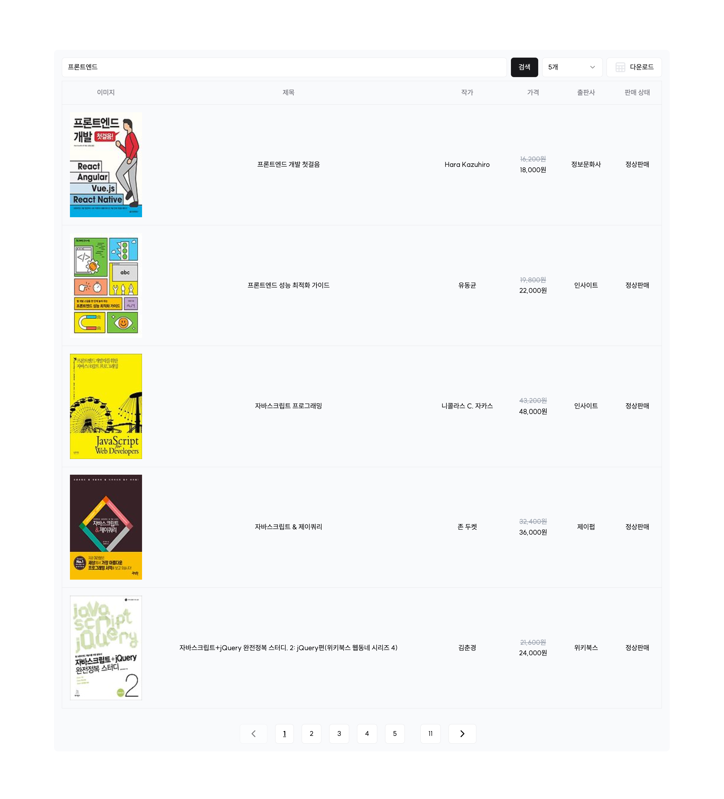

  
<h2 align=center>:books: Study Note :books:</h2>

  

  
<h2 align=center><b>:bulb: Skill :bulb:</b></h2>

  

  
  
  
   

 

  
<h2 align=center><b>:computer: My project :computer:</b></h2>
<table>
  <tbody>
	  <tr>
			<td>
				
			</td>
			<td>
				
			</td>
			
	</tr>
	<tr>
		<td align="center">Portfolio</td>
		<td align="center">Kakao-book-search</td>
	</tr>
  </tbody>
</table>

